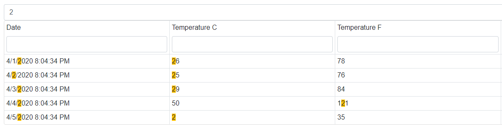

<!-- default badges list -->

<!-- default badges end -->

# DataGrid for Blazor - How to implement an external search panel

You can create a [filer row](https://docs.devexpress.com/Blazor/DevExpress.Blazor.DxDataGrid-1.ShowFilterRow) in the Data Grid component. The filter row searches for the entered text in one column. If you want to look for the entered text in all Data Grid's columns, implement an external search panel.

To achieve this, place the Text Box component in the page markup and implement the search function in the the Text Box's [TextChanged](https://docs.devexpress.com/Blazor/DevExpress.Blazor.DxTextBox.TextChanged) event. 

## Files to Look At

* [Index.razor](./CS/DevExpressBlazorStarter/Pages/Index.razor)
* [_Host.cshtml](./CS/DevExpressBlazorStarter/Pages/_Host.cshtml)

## Documentation

* [SingleSelectedDataRow](https://docs.devexpress.com/Blazor/DevExpress.Blazor.DxDataGrid-1.SingleSelectedDataRow)
* [ShowFilerRow](https://docs.devexpress.com/Blazor/DevExpress.Blazor.DxDataGrid-1.ShowFilterRow)

## More Examples

* [Data Grid - Inline Editing](https://github.com/DevExpress-Examples/Blazor-dxdatagrid-inline-editing)
* [Data Grid - Open an Edit Form on a Separate Page](https://github.com/DevExpress-Examples/blazor-DxDataGrid-Separate-Edit-Form)
